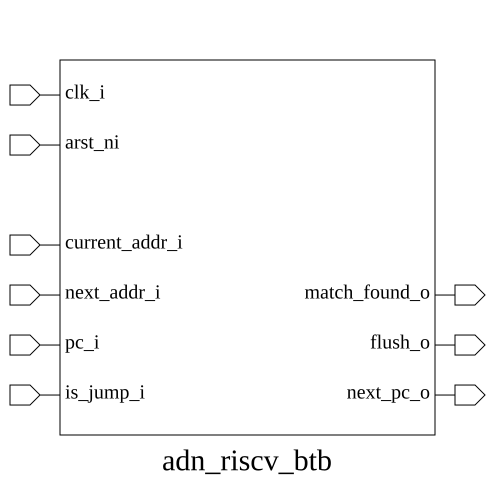

# adn_riscv_btb (module)

### Author: Foez Ahmed (foez.official@gmail.com)

### Source: adn_riscv_btb.sv

## Top IO

## Parameters

|Name|Type|Dimension|Default|Description|
|-|-|-|-|-|
|NUM_BTB|int||32|Number of entries in the Branch Target Buffer|
|XLEN|int||64|Data width of the processor|

## Ports

|Name|Direction|Type|Dimension|Description|
|-|-|-|-|-|
|clk_i|input|logic||Clock input|
|arst_ni|input|logic||Asynchronous reset input|
|current_addr_i|input|logic [XLEN-1:0]||Current address (EXEC) input|
|next_addr_i|input|logic [XLEN-1:0]||Next address (EXEC) input|
|pc_i|input|logic [XLEN-1:0]||Program counter (IF) input|
|is_jump_i|input|logic||Is jump/branch (IF) input|
|match_found_o|output|logic||Found match in buffer output|
|flush_o|output|logic||Pipeline flush signal output|
|next_pc_o|output|logic [XLEN-1:0]||Next program counter (in case of jump) output|

## Description

@foez---bhai, write the purpose of this module in markdown format here. This is already in multi-line comment, so don't add any additional comment syntax.

@foez---bhai, describe the use case of this module in markdown format here. This is already in multi-line comment, so don't add any additional comment syntax.

| REVISION | DATE       | AUTHOR          | DESCRIPTION                                            |
|----------|------------|-----------------|--------------------------------------------------------|
| 0.1      | 2026-08-29 | Foez Ahmed | Initial version                                        |
| 1.0      | 2026-08-29 | Foez Ahmed | Stable release                                         |

Author : Foez Ahmed (foez.official@gmail.com)
