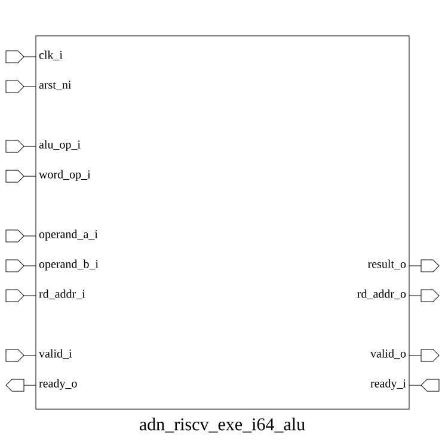

# adn_riscv_exe_i64_alu (module)

### Author: Mohiuddin Reyad (mreyad30207@gmail.com)

### Source: adn_riscv_exe_i64_alu.sv

## Top IO

## Parameters

|Name|Type|Dimension|Default|Description|
|-|-|-|-|-|
|XLEN|int||64||

## Ports

|Name|Direction|Type|Dimension|Description|
|-|-|-|-|-|
|clk_i|input|logic||------------------------------------------------ required for pipelining ------------------------------------------------|
|arst_ni|input|logic|||
|alu_op_i|input|rv_op_t||------------------------------------------------ ALU operation control ------------------------------------------------|
|operand_a_i|input|logic [XLEN-1:0]||contents of the register: operand value|
|operand_b_i|input|logic [XLEN-1:0]||contents of the register: operand value, or|
|rd_addr_i|input|logic [4:0]||index of the destination register|
|valid_i|input|logic||------------------------------------------------ Input handshake ------------------------------------------------|
|ready_o|output|logic|||
|result_o|output|logic [XLEN-1:0]||------------------------------------------------ ALU result ------------------------------------------------|
|rd_addr_o|output|logic [4:0]|||
|valid_o|output|logic||------------------------------------------------ Output handshake ------------------------------------------------|
|ready_i|input|logic|||

## Description

@foez---bhai, write the purpose of this module in markdown format here. This is already in multi-line comment, so don't add any additional comment syntax.

@foez---bhai, describe the use case of this module in markdown format here. This is already in multi-line comment, so don't add any additional comment syntax.

| REVISION | DATE       | AUTHOR          | DESCRIPTION                                            |
|----------|------------|-----------------|--------------------------------------------------------|
| 0.1      | 2026-09-01 | Mohiuddin Reyad | Initial version                                        |
| 1.0      | 2026-09-01 | Mohiuddin Reyad | Stable release                                         |

Author : Mohiuddin Reyad (mreyad30207@gmail.com)
