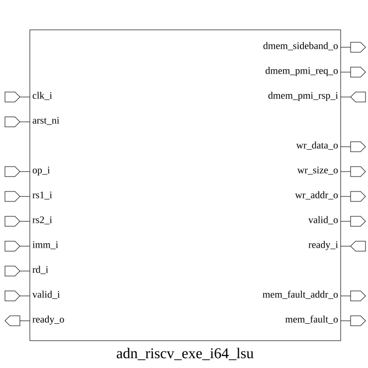
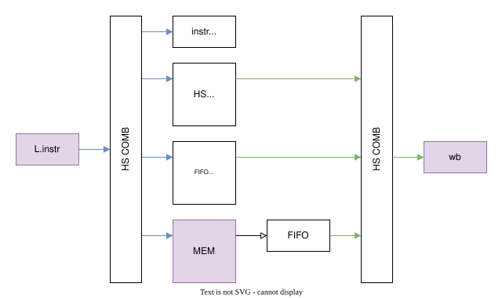

# adn_riscv_exe_i64_lsu (module)

### Author: Foez Ahmed (foez.official@gmail.com)

### Source: adn_riscv_exe_i64_lsu.sv

## Top IO

## Parameters

|Name|Type|Dimension|Default|Description|
|-|-|-|-|-|
|rv_op_t|type||logic||
|pmi_req_t|type||logic||
|pmi_rsp_t|type||logic||

## Ports

|Name|Direction|Type|Dimension|Description|
|-|-|-|-|-|
|clk_i|input|logic||Clock input|
|arst_ni|input|logic||Asynchronous reset, active low|
|op_i|input|rv_op_t||Operation inputs|
|rs1_i|input|logic [63:0]||Source register 1 input|
|rs2_i|input|logic [63:0]||Source register 2 input|
|imm_i|input|logic [11:0]||Immediate input|
|rd_i|input|logic [ 5:0]||Destination register input|
|valid_i|input|logic||Valid input signal|
|ready_o|output|logic||Ready output signal|
|dmem_sideband_o|output|sideband_t||Memory sideband signals|
|dmem_pmi_req_o|output|pmi_req_t||PMI request output|
|dmem_pmi_rsp_i|input|pmi_rsp_t||PMI grant input|
|wr_data_o|output|logic [63:0]||Write data output|
|wr_size_o|output|logic [ 1:0]||Write size output|
|wr_addr_o|output|logic [ 5:0]||Write address output|
|valid_o|output|logic||Valid output signal|
|ready_i|input|logic||Ready input signal|
|mem_addr_o|output|logic [63:0]||Memory address output|
|mem_fault_o|output|logic||Memory fault output|

## Description

@foez---bhai, write the purpose of this module in markdown format here. This is already in multi-line comment, so don't add any additional comment syntax.

@foez---bhai, describe the use case of this module in markdown format here. This is already in multi-line comment, so don't add any additional comment syntax.

| REVISION | DATE       | AUTHOR          | DESCRIPTION                                            |
|----------|------------|-----------------|--------------------------------------------------------|
| 0.1      | 2026-09-01 | Foez Ahmed      | Initial version                                        |
| 1.0      | 2026-09-01 | Foez Ahmed      | Stable release                                         |

Author : Foez Ahmed (foez.official@gmail.com)
