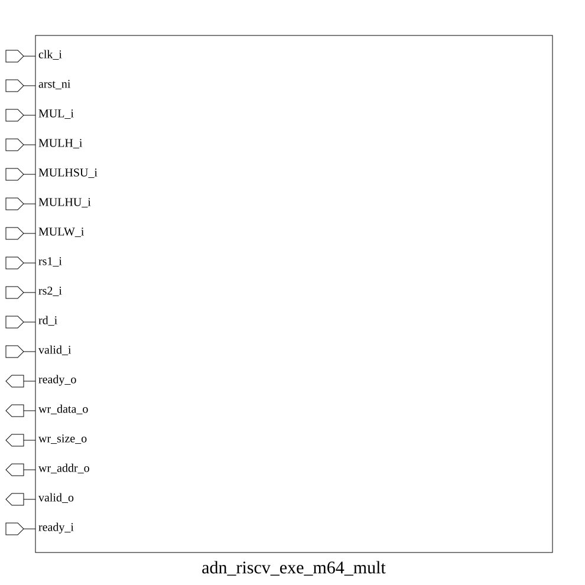
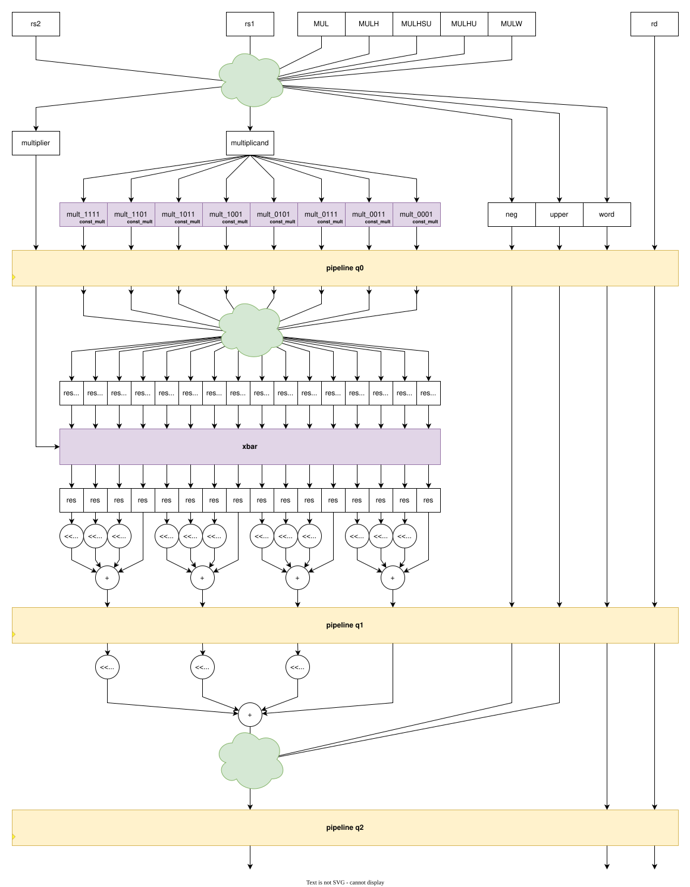

# adn_riscv_exe_m64_mult (module)

### Author: Foez Ahmed (foez.official@gmail.com)

### Source: adn_riscv_exe_m64_mult.sv

## Top IO

## Parameters

_None_

## Ports

|Name|Direction|Type|Dimension|Description|
|-|-|-|-|-|
|clk_i|input|logic||Clock input|
|arst_ni|input|logic||Asynchronous reset, active low|
|MUL_i|input|logic||Multiply operation signal|
|MULH_i|input|logic||Multiply high operation signal|
|MULHSU_i|input|logic||Multiply high signed-unsigned operation signal|
|MULHU_i|input|logic||Multiply high unsigned operation signal|
|MULW_i|input|logic||Multiply word operation signal|
|rs1_i|input|logic [63:0]||Source register 1 input|
|rs2_i|input|logic [63:0]||Source register 2 input|
|rd_i|input|logic [5:0]||Destination register input|
|valid_i|input|logic||Valid input signal|
|ready_o|output|logic||Ready output signal|
|wr_data_o|output|logic [63:0]||Write data output|
|wr_size_o|output|logic [ 1:0]||Write size output|
|wr_addr_o|output|logic [ 5:0]||Write address output|
|valid_o|output|logic||Valid output signal|
|ready_i|input|logic||Ready input signal|

## Description

# Purpose
This module implements a high-performance 64-bit integer multiplier for the RISC-V architecture. It supports standard multiplication (MUL), high-part multiplication (MULH, MULHSU, MULHU), and word-sized multiplication (MULW) operations using a multi-stage pipelined architecture.

### Use Case
This module is designed to be integrated into the execution stage of a 64-bit RISC-V processor pipeline. It serves as the primary arithmetic unit for integer multiplication instructions. By utilizing a multi-stage pipeline, it balances high throughput with timing constraints, allowing the processor to handle complex multiplication operations without stalling the execution flow. It is particularly useful in compute-intensive applications requiring frequent 64-bit arithmetic operations.

| REVISION | DATE       | AUTHOR          | DESCRIPTION                                            |
|----------|------------|-----------------|--------------------------------------------------------|
| 0.1      | 2026-09-01 | Foez Ahmed | Initial version                                        |
| 1.0      | 2026-09-01 | Foez Ahmed | Stable release                                         |

Author : Foez Ahmed (foez.official@gmail.com)
