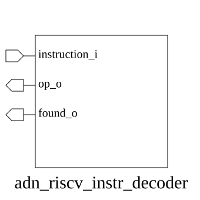

# adn_riscv_instr_decoder (module)

### Author: Foez Ahmed (foez.official@gmail.com)

### Source: adn_riscv_instr_decoder.sv

## Top IO

## Parameters

|Name|Type|Dimension|Default|Description|
|-|-|-|-|-|
|XLEN|||64|Data path width in bits|

## Ports

|Name|Direction|Type|Dimension|Description|
|-|-|-|-|-|
|instruction_i|input|logic [31:0]||Raw 32-bit instruction from fetch stage|
|op_o|output|rv_op_t||Decoded internal operation type|
|found_o|output|logic||Valid instruction identification flag|

## Description

### Purpose
The `adn_riscv_instr_decoder` module is responsible for parsing 32-bit RISC-V instructions and decoding them into internal operation types (`rv_op_t`). It serves as the primary instruction identification unit within the ADN-VLSI RISC-V pipeline, determining the instruction format and validity to facilitate downstream execution.

### Use Case
This module acts as the central nervous system for instruction dispatch. It takes a raw 32-bit instruction word from the fetch stage and translates it into a structured `rv_op_t` format that the execution units can actually understand. It is essential for identifying opcode, funct3, and funct7 fields, ensuring that the pipeline doesn't try to execute garbage data. Basically, it's the translator that keeps the CPU from having a total meltdown when it sees a bit pattern it doesn't recognize.

| REVISION | DATE       | AUTHOR          | DESCRIPTION                                            |
|----------|------------|-----------------|--------------------------------------------------------|
| 0.1      | 2026-08-18 | Foez Ahmed | Initial version                                        |
| 1.0      | 2026-08-18 | Foez Ahmed | Stable release                                         |

Author : Foez Ahmed (foez.official@gmail.com)
