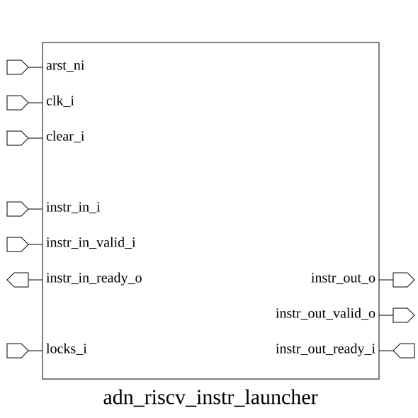

# adn_riscv_instr_launcher (module)

### Author: Foez Ahmed (foez.official@gmail.com)

### Source: adn_riscv_instr_launcher.sv

## Top IO

## Parameters

|Name|Type|Dimension|Default|Description|
|-|-|-|-|-|
|decoded_instr_t|type||logic|Data type for the decoded instruction|
|NR|int||32|Number of registers to track for dependencies|
|NOS|int||8|Number of pipeline stages|

## Ports

|Name|Direction|Type|Dimension|Description|
|-|-|-|-|-|
|arst_ni|input|logic||Asynchronous reset, active low|
|clk_i|input|logic||Clock input|
|clear_i|input|logic||Synchronous clear signal|
|instr_in_i|input|decoded_instr_t||Incoming decoded instruction|
|instr_in_valid_i|input|logic||Valid signal for incoming instruction|
|instr_in_ready_o|output|logic||Ready signal for incoming instruction|
|locks_i|input|logic [NR-1:0]||Input lock signals for registers from regfile|
|instr_out_o|output|decoded_instr_t||Outgoing decoded instruction|
|instr_out_valid_o|output|logic||Valid signal for outgoing instruction|
|instr_out_ready_i|input|logic||Ready signal for outgoing instruction|

## Description

# Purpose
The `adn_riscv_instr_launcher` module serves as a high-performance instruction dispatch and ordering unit for a RISC-V processor. It manages a multi-stage pipeline structure that buffers incoming decoded instructions, performs dependency checking via order checkers, and uses a fixed-priority arbiter to ensure instructions are launched to the execution units in the correct order while maintaining data integrity and handling resource locks.

# Use Case
The `adn_riscv_instr_launcher` is designed to be placed between the instruction decoder and the execution units in a RISC-V pipeline. Its primary use cases include:
- **Instruction Buffering**: Providing a multi-stage buffer to decouple the decode stage from execution, allowing for smoother instruction flow.
- **Dependency Management**: Ensuring that instructions with data dependencies (e.g., register hazards) are held back until their required operands are available.
- **In-Order Dispatch**: Guaranteeing that instructions are issued to execution units in the correct program order, even if they arrive at the launcher out of sequence or are delayed by resource locks.
- **Resource Arbitration**: Managing access to shared execution resources by arbitrating between multiple pending instructions across different pipeline stages.

| REVISION | DATE       | AUTHOR          | DESCRIPTION                                            |
|----------|------------|-----------------|--------------------------------------------------------|
| 0.1      | 2026-08-29 | Foez Ahmed | Initial version                                        |
| 1.0      | 2026-08-29 | Foez Ahmed | Stable release                                         |

Author : Foez Ahmed (foez.official@gmail.com)
