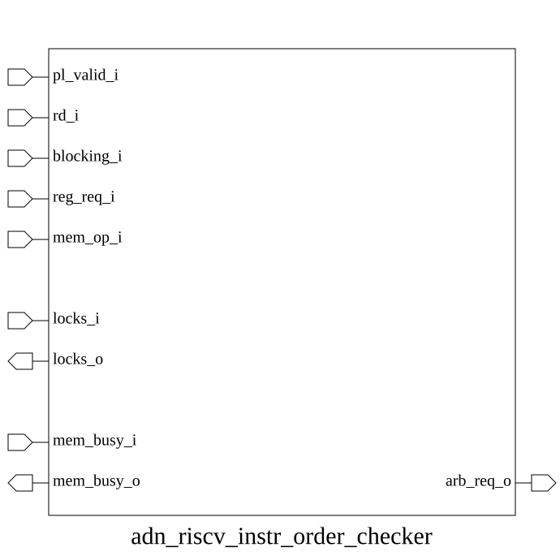

# adn_riscv_instr_order_checker (module)

### Author: Foez Ahmed (foez.official@gmail.com)

### Source: adn_riscv_instr_order_checker.sv

## Top IO

## Parameters

|Name|Type|Dimension|Default|Description|
|-|-|-|-|-|
|NR|int||32||

## Ports

|Name|Direction|Type|Dimension|Description|
|-|-|-|-|-|
|pl_valid_i|input|logic|||
|blocking_i|input|logic|||
|rd_i|input|logic [$clog2(NR)-1:0]|||
|reg_req_i|input|logic [ NR-1:0]|||
|locks_i|input|logic [NR-1:0]|||
|locks_o|output|logic [NR-1:0]|||
|mem_op_i|input|logic|||
|mem_busy_i|input|logic|||
|mem_busy_o|output|logic|||
|arb_req_o|output|logic|||

## Description

@foez---bhai, write the purpose of this module in markdown format here. This is already in multi-line comment, so don't add any additional comment syntax.

@foez---bhai, describe the use case of this module in markdown format here. This is already in multi-line comment, so don't add any additional comment syntax.

| REVISION | DATE       | AUTHOR          | DESCRIPTION                                            |
|----------|------------|-----------------|--------------------------------------------------------|
| 0.1      | 2026-08-29 | Foez Ahmed      | Initial version                                        |
| 1.0      | 2026-08-29 | Foez Ahmed      | Stable release                                         |

Author : Foez Ahmed (foez.official@gmail.com)
