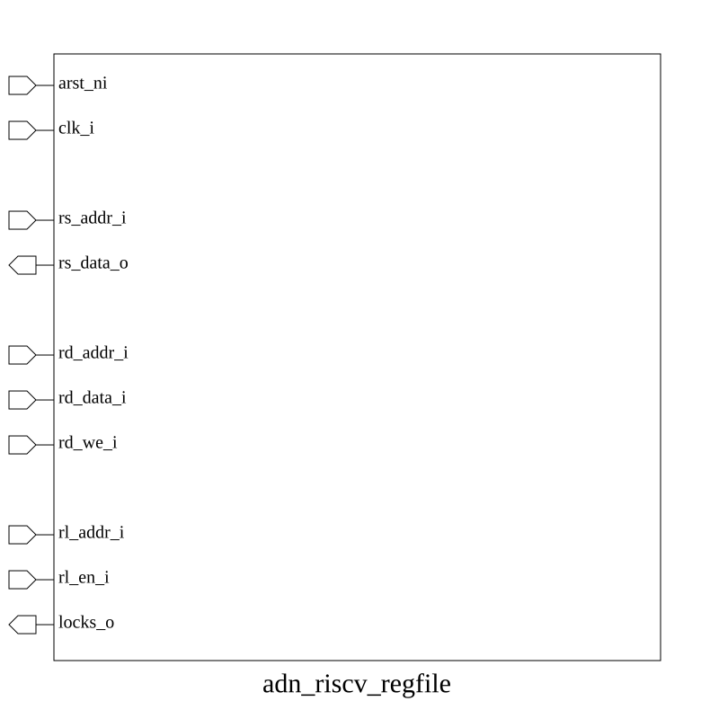

# adn_riscv_regfile (module)

### Author: Foez Ahmed (foez.official@gmail.com)

### Source: adn_riscv_regfile.sv

## Top IO

## Parameters

|Name|Type|Dimension|Default|Description|
|-|-|-|-|-|
|NUM_RD|int||1|Number of write ports|
|NUM_RS|int||2|Number of read ports|
|NUM_REG|int||32|Number of registers in the file|
|DATA_WIDTH|int||64|Width of each register in bits|
|NUM_ZERO|int||1|Number of hardwired zero registers|
|OUTPUT_PL|bit||0|@foez-bhai, add comments|
|LOCKS_EN|bit||1|Enable register locking mechanism|

## Ports

|Name|Direction|Type|Dimension|Description|
|-|-|-|-|-|
|arst_ni|input|logic||Asynchronous reset, active low|
|clk_i|input|logic||System clock|
|rs_addr_i|input|logic [$clog2(NUM_REG)-1:0]|[NUM_RS]|Read source addresses|
|rs_data_o|output|logic [ DATA_WIDTH-1:0]|[NUM_RS]|Read source data outputs|
|rd_addr_i|input|logic [$clog2(NUM_REG)-1:0]|[NUM_RD]|Write destination addresses|
|rd_data_i|input|logic [ DATA_WIDTH-1:0]|[NUM_RD]|Write destination data inputs|
|rd_we_i|input|logic|[NUM_RD]|Write enable signals|
|rl_addr_i|input|logic [$clog2(NUM_REG)-1:0]|[NUM_RD]|Register lock addresses|
|rl_we_i|input|logic|[NUM_RD]|Register lock enable signals|
|locks_o|output|logic [ NUM_REG-1:0]||Current lock status vector|

## Description

### Purpose
This module implements a parameterized RISC-V register file supporting multiple read and write
ports, optional register locking mechanisms, and configurable data widths. It provides asynchronous
reset capabilities and handles transparent read-after-write behavior via internal combinatorial
forwarding logic.

### Use Case
The `adn_riscv_regfile` is designed to serve as the primary architectural state storage in a RISC-V
processor pipeline. Its primary use cases include:
- **General Purpose Register (GPR) File:** Providing high-speed access for integer arithmetic units.
- **Pipeline Integration:** Supporting multiple read/write ports to facilitate concurrent
instruction dispatch and write-back.
- **Hazard Management:** Utilizing internal combinatorial forwarding to ensure that read operations
immediately reflect pending writes within the same cycle.
- **Resource Locking:** Enabling atomic operations or synchronization primitives by tracking
register availability via the optional locking mechanism.

| REVISION | DATE       | AUTHOR          | DESCRIPTION                                            |
|----------|------------|-----------------|--------------------------------------------------------|
| 0.1      | 2026-08-14 | Foez Ahmed      | Initial version                                        |
| 1.0      | 2026-08-14 | Foez Ahmed      | Stable release                                         |
| 1.1      | 2026-08-15 | Foez Ahmed      | Added optional output pipelining feature               |

Author : Foez Ahmed (foez.official@gmail.com)
