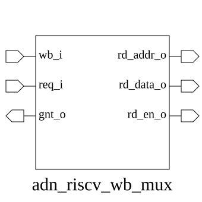

# adn_riscv_wb_mux (module)

### Author: Foez Ahmed (foez.official@gmail.com)

### Source: adn_riscv_wb_mux.sv

## Top IO

## Parameters

|Name|Type|Dimension|Default|Description|
|-|-|-|-|-|
|write_back_t|type||logic|Data structure for WB request|
|NUM_REQ|int||4|Number of input request ports|
|HIGH_INDEX_PRIORITY|bit||0|Priority scheme: 0=Low index, 1=High index|

## Ports

|Name|Direction|Type|Dimension|Description|
|-|-|-|-|-|
|wb_i|input|write_back_t [NUM_REQ-1:0]||Array of WB data inputs|
|req_i|input|logic [NUM_REQ-1:0]||Request signals for each port|
|gnt_o|output|logic [NUM_REQ-1:0]||Grant signals for each port|
|rd_addr_o|output|logic [ 5:0]||Selected register write address|
|rd_data_o|output|logic [63:0]||Selected sign-extended write data|
|rd_en_o|output|logic||Write enable signal|

## Description

### Purpose
This module functions as a Write-Back (WB) multiplexer for the ADN-RISC-V core. It aggregates multiple write-back requests from various pipeline stages or functional units, arbitrates between them based on a fixed priority scheme, and routes the selected data and address to the register file write port, including necessary sign-extension logic.

### Use Case
The `adn_riscv_wb_mux` is utilized at the final stage of the pipeline where multiple execution units (e.g., ALU, Load-Store Unit, Multiplier) attempt to write results back to the register file simultaneously. It ensures that only one valid result is committed per cycle based on the configured priority, preventing structural hazards and ensuring data integrity during the write-back phase.

| REVISION | DATE       | AUTHOR          | DESCRIPTION                                            |
|----------|------------|-----------------|--------------------------------------------------------|
| 0.1      | 2026-09-08 | Foez Ahmed      | Initial version                                        |
| 1.0      | 2026-09-08 | Foez Ahmed      | Stable release                                         |

Author : Foez Ahmed (foez.official@gmail.com)
